<div align="center">

# 🐾 Whiskr

**Find the perfect name for your pet: swipe through hand-picked names with meanings, filter by species and style, save your favorites, name a whole litter and keep your pets' profiles. Built with Flutter for iOS, Android, web, macOS, Windows and Linux.**

[](https://flutter.dev)
[](https://dart.dev)
[](https://m3.material.io)
[](https://pub.dev/packages/provider)
[](#getting-started)
[](LICENSE)
<br />
[](https://github.com/boushib/namify/commits/main)
[](https://github.com/boushib/namify)
[](https://github.com/boushib/namify)

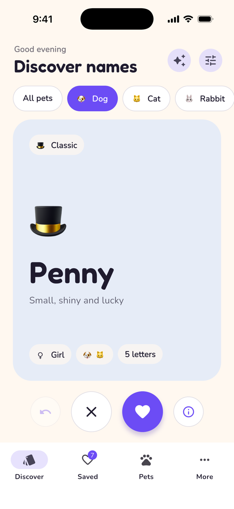&nbsp;&nbsp;
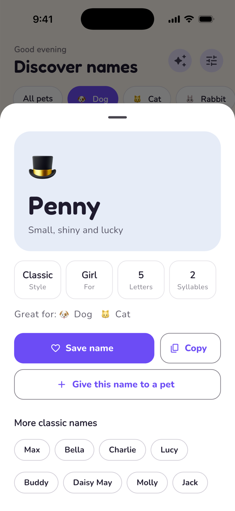&nbsp;&nbsp;
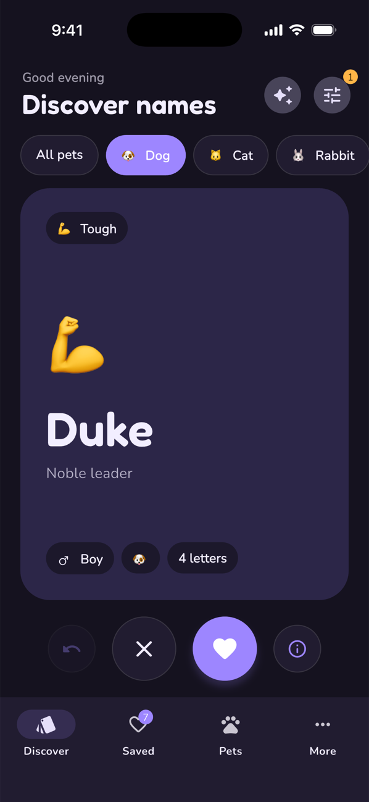

</div>

## Screenshots

### On your phone

<table><tr><td align="center" width="33%">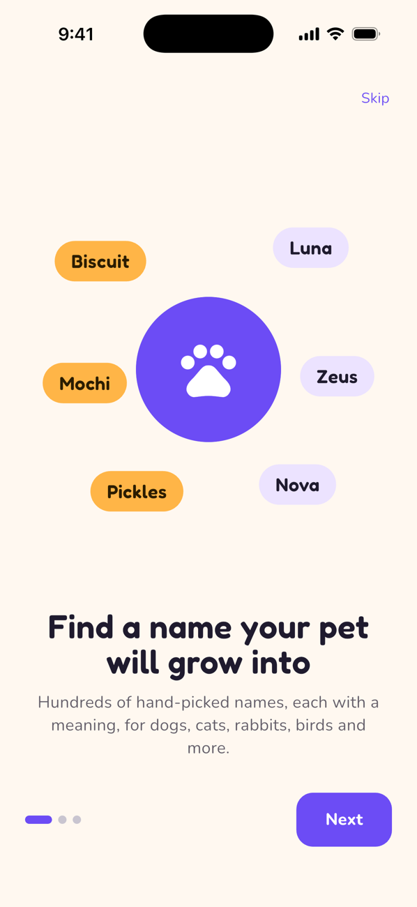<br /><sub>Onboarding</sub></td><td align="center" width="33%">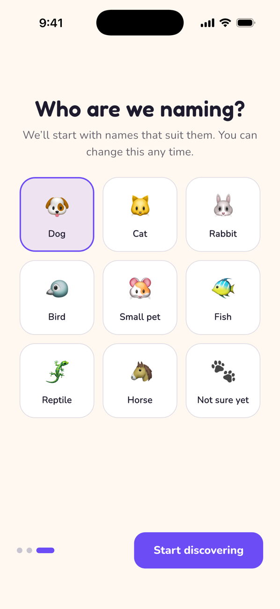<br /><sub>Pick your pet</sub></td><td align="center" width="33%"><br /><sub>Swipe to like or skip</sub></td></tr></table>

<table><tr><td align="center" width="33%"><br /><sub>Meaning, tags and similar names</sub></td><td align="center" width="33%">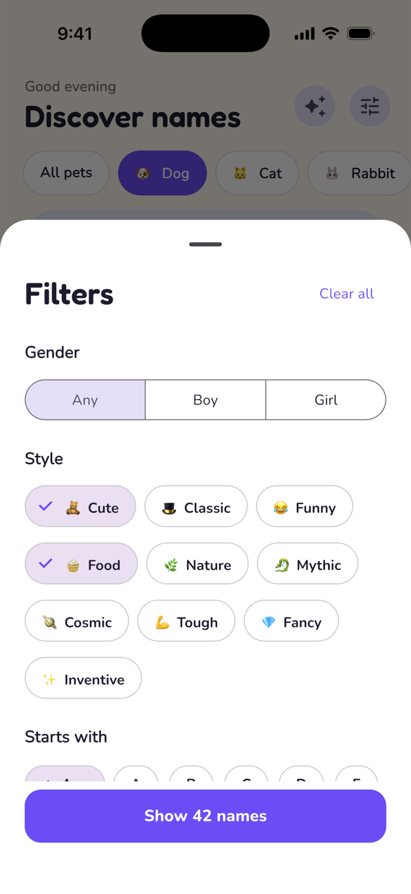<br /><sub>Gender, style, letter and length</sub></td></tr></table>

<table><tr><td align="center" width="33%">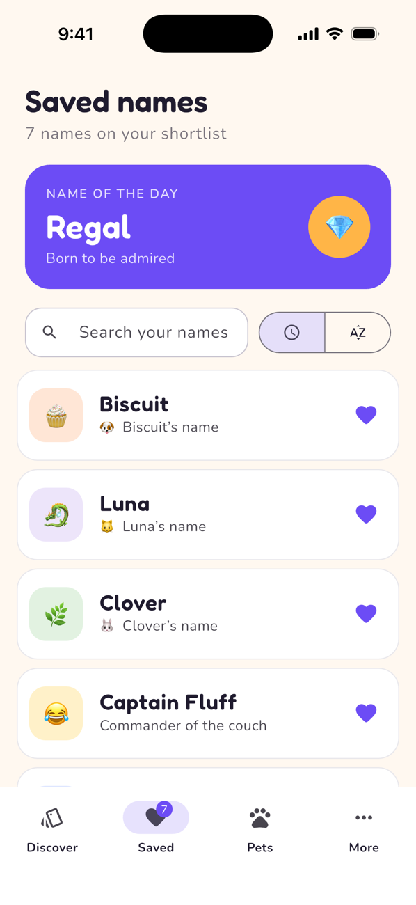<br /><sub>Saved names and name of the day</sub></td><td align="center" width="33%">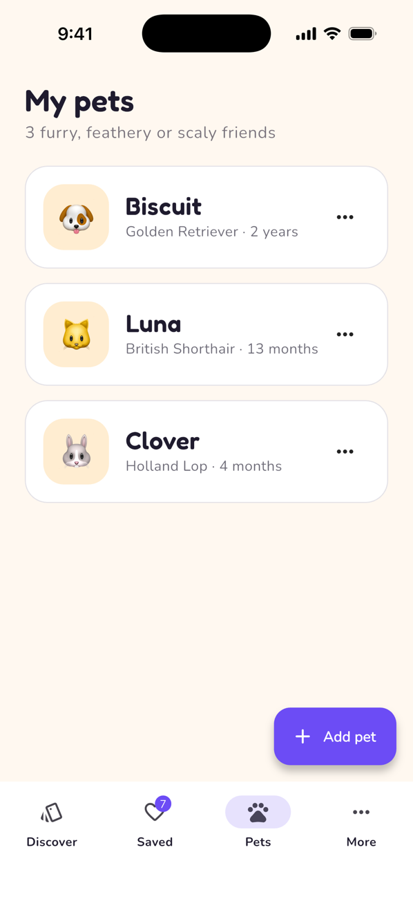<br /><sub>Your pets, with breed and age</sub></td><td align="center" width="33%">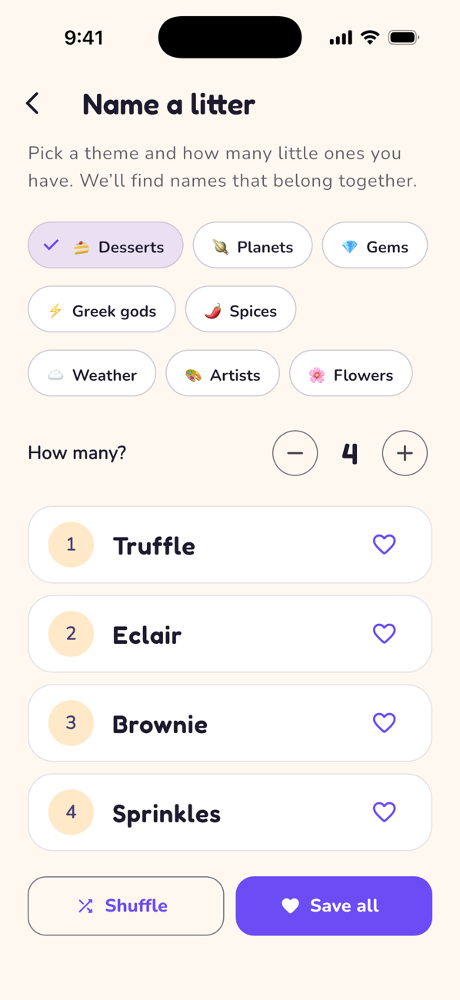<br /><sub>Themed names for a litter</sub></td></tr></table>

<table><tr><td align="center" width="33%"><br /><sub>Dark mode</sub></td><td align="center" width="33%">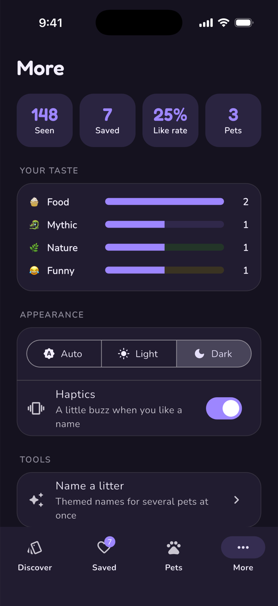<br /><sub>Stats, taste and settings</sub></td></tr></table>

### On desktop and the web

The same app on a wide screen: the tabs move to a side rail, pages keep a readable width, and the arrow keys swipe cards.

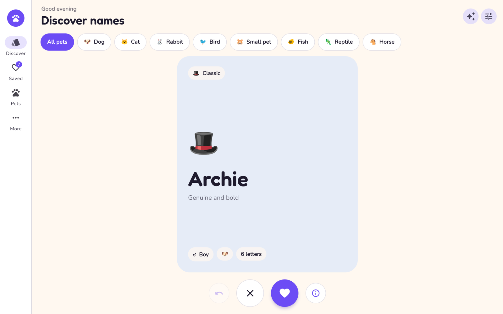

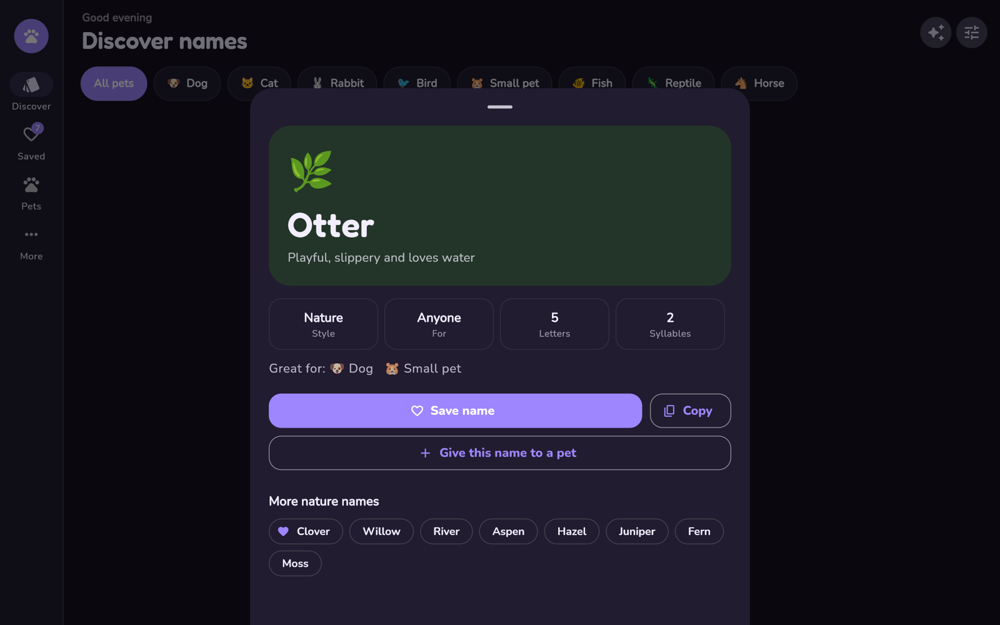

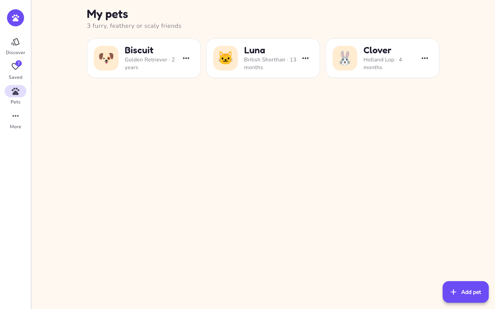

## About

Namify started in 2024 as a small Flutter app that showed random two-word names from the `english_words` package. In 2026 I rebuilt it as **Whiskr** on **Flutter 3.47** with Material 3: a real pet-name catalog, a swipe deck, pet profiles and a new look in violet and honey, with Fredoka and Nunito type. The original random names live on as the "Inventive" style.

Everything stays on the device: names, notes, pets and stats are saved locally with `shared_preferences`, and favorites from the first version are carried over.

## Features

### Discover
- **Swipe deck:** drag a card right to like it or left to skip it, with a tilt, LIKE and NOPE stamps, a heart burst and haptics; or use the buttons, or the arrow keys on a computer
- **Undo** the last decisions
- **Filters:** species chips (dog, cat, rabbit, bird, small pet, fish, reptile, horse), plus gender, ten styles, first letter and maximum length in a sheet that shows how many names match; filters are remembered
- **Over 200 hand-picked names**, each with a meaning, across cute, classic, funny, food, nature, mythic, cosmic, tough and fancy styles, plus endless invented names in the Inventive style
- **Name details** for every name, with similar names to explore

### Your names and pets
- **Saved names** with search, sorting by newest or A to Z, notes, copy, and swipe to remove with undo
- **Name of the day**, the same for everyone on a given day
- **Name a litter** from eight themes (desserts, planets, gems, Greek gods, spices, weather, artists, flowers) for 2 to 8 pets, and save them all at once
- **My pets:** add pets with species, breed and birthday (shown as an age), pick their name from your saved names, and see which saved names are taken

### App
- **Onboarding** on first launch that asks which kind of pet you're naming
- **Stats:** names seen, saved, like rate, pets, and which styles you save most
- **Light and dark themes** that follow the system, or set them yourself
- **Help:** suggest a name or report a bug through GitHub Issues
- **Every device:** bottom navigation on phones, a side rail on tablets, desktop and web, with page widths that stay readable on big screens
- A custom paw icon on every platform

## Getting started

Requires the [Flutter SDK](https://docs.flutter.dev/get-started/install) (3.47 or newer).

```bash
flutter pub get
flutter run
```

Pick a device when asked, or name one:

| Platform | Command |
| --- | --- |
| iOS Simulator | `flutter run -d ios` |
| Android | `flutter run -d android` |
| Web | `flutter run -d chrome` |
| macOS | `flutter run -d macos` |
| Windows / Linux | `flutter run -d windows` / `flutter run -d linux` (on those systems) |

iOS and macOS use Swift Package Manager, so CocoaPods isn't needed.

### Useful commands

| Command | What it does |
| --- | --- |
| `flutter test` | Unit tests for the catalog, deck, filters, favorites and pets |
| `flutter analyze` | Lints |
| `flutter build web` | Production web build in `build/web` |
| `dart run flutter_launcher_icons` | Regenerates the app icons from `assets/icon/` |
| `flutter run --dart-define=DEMO=true` | Starts with sample saved names, pets and stats, for screenshots |

## Project structure

```
lib/data/names.dart       The name catalog and litter themes
lib/models/               Names, species, styles, favorites and pets
lib/state/                Stores for the deck and filters, favorites, pets and settings
lib/screens/              Discover, Saved, Pets, More, Name a litter and onboarding
lib/widgets/              Swipe deck, name card, name details, filters and pet editor
lib/theme.dart            Colors and type for light and dark themes
assets/icon/              The app icon (SVG and PNG)
```

## License

[MIT](LICENSE) © El Hassane Boushib
